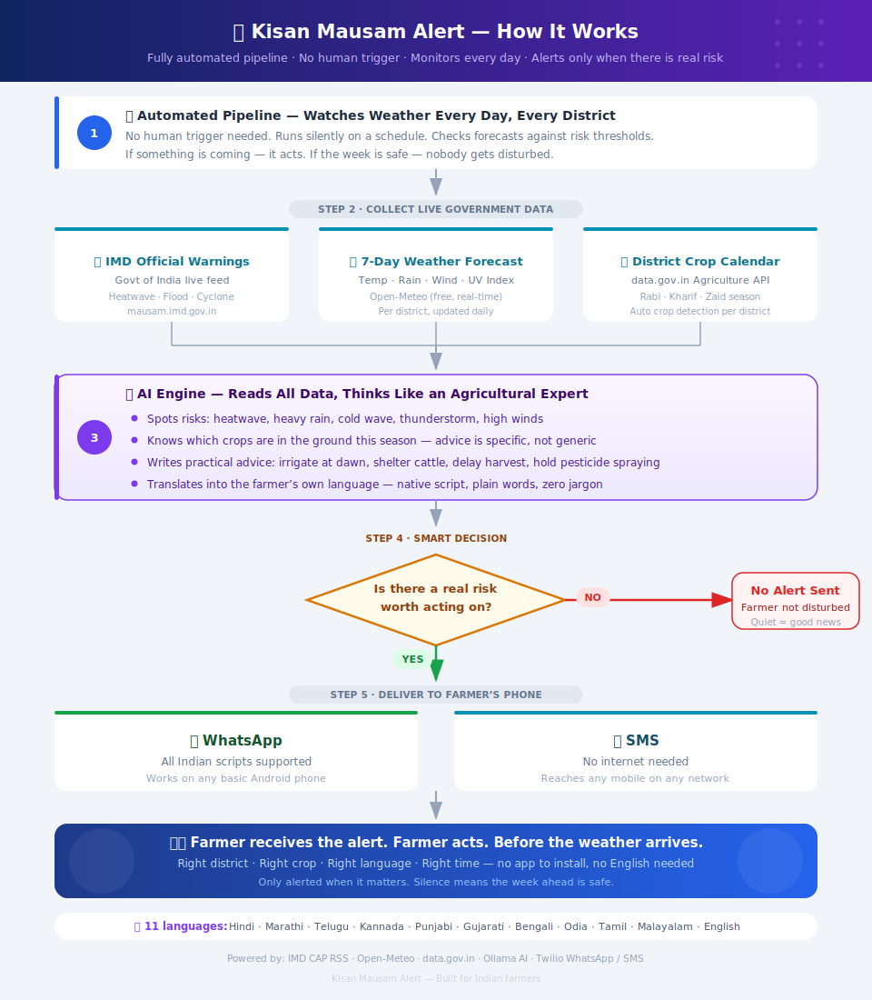

<div align="center">



<br/>

# 🌾 Kisan Mausam Alert

### Automated AI weather alerts for Indian farmers — in their own language, on their phone, only when there's real risk

<br/>

[](https://github.com/yogeshwankhede007/kisan-mausam-alert/actions)
[](https://ollama.com)
[](https://github.com/yogeshwankhede007/kisan-mausam-alert)
[](https://mausam.imd.gov.in)
[](https://www.twilio.com)
[](LICENSE)

<br/>

> *IMD forecast data exists. Government crop records exist. The gap was always the last mile —*
> *turning all of it into plain advice, in the farmer's own language, before the weather hits.*

</div>

---

## ⚡ What It Does

The pipeline runs automatically on GitHub Actions. It watches the forecast every day. When there is a real risk — heatwave, heavy rain, cold wave, thunderstorm — it sends a targeted advisory to each registered farmer. When the week looks calm, it stays silent.

```
📡 Live IMD + Open-Meteo data  →  🌾 Crop calendar per district  →  🤖 AI writes advisory
                                                                            ↓
👨‍🌾 Farmer reads it in their language  ←  💬 WhatsApp / SMS  ←  🔍 Send only if real risk
```

**No human trigger. No daily spam. No English-only dashboard. No app to install.**

---

## 🌦 What the Alerts Cover

| Weather event | Threshold | Example advice sent to farmer |
|---------------|-----------|-------------------------------|
| 🌡 Heatwave | ≥ 40 °C | Irrigate sugarcane at dawn · shelter cattle · delay sowing |
| 🌧 Heavy rain | ≥ 64.5 mm | Advance wheat harvest · hold pesticide spraying · check drainage |
| 🥶 Cold wave | ≤ 10 °C | Cover mustard/gram seedlings · protect cattle overnight |
| ⛈ Thunderstorm | WMO 95/96/99 | Keep cattle indoors · avoid open fields |
| 💨 High wind | ≥ 60 km/h | Stake tall crops · secure storage covers |

---

## 🗣 11 Indian Languages

<div align="center">

|  |  |  |  |  |  |  |  |  |  |  |
|--|--|--|--|--|--|--|--|--|--|--|
| हिंदी | मराठी | తెలుగు | ಕನ್ನಡ | ਪੰਜਾਬੀ | ગુજરાતી | বাংলা | ଓଡ଼ିଆ | தமிழ் | മലയാളം | English |

</div>

---

## 📱 Sample Alert

<table>
<tr>
<td width="50%">

**Marathi — Pune heatwave**
```
उष्णतेची लाट येणार!
१४–१७ एप्रिल रोजी ४१°C.
ऊस-कांदा: पहाटे पाणी द्या.
जनावरांना सावलीत ठेवा.
– IMD हवामान इशारा
```

</td>
<td width="50%">

**Telugu — Warangal heatwave**
```
హెచ్చరిక! ఏప్రిల్ 14–18
వరంగల్‌లో 40°C+.
పత్తి: తెల్లవారుజామున నీరు.
పశువులకు నీడ ఇవ్వండి.
– IMD వాతావరణ హెచ్చరిక
```

</td>
</tr>
</table>

---

## 🚀 Quick Start

<details>
<summary><b>Option A — Run on GitHub Actions (recommended, fully automated)</b></summary>

### Step 1 — Push to GitHub

```bash
git clone https://github.com/yogeshwankhede007/kisan-mausam-alert.git
cd kisan-mausam-alert
git push -u origin main
```

### Step 2 — Add Secrets

Go to repo → **Settings → Secrets and variables → Actions**

| Secret | Where to get it |
|--------|----------------|
| `TWILIO_ACCOUNT_SID` | Twilio Console → Account Info |
| `TWILIO_AUTH_TOKEN` | Twilio Console → Account Info |
| `TWILIO_MESSAGING_SERVICE_SID` | Twilio Console → Messaging → Services |
| `TWILIO_WHATSAPP_FROM` | `whatsapp:+14155238886` |
| `DATA_GOV_IN_API_KEY` | [data.gov.in](https://data.gov.in/user/register) *(optional)* |

### Step 3 — Add farmers

Edit `farmers_sample.json` with real numbers, commit and push. The pipeline seeds the DB on every run.

### Step 4 — Done

Pipeline runs at **11 AM IST daily** automatically via cron. Trigger manually anytime: **Actions → Daily Weather Alerts → Run workflow**.

</details>

<details>
<summary><b>Option B — Run locally</b></summary>

### Prerequisites

| Tool | Install |
|------|---------|
| Python 3.10+ | [python.org](https://python.org) |
| Ollama (free local AI) | `curl -fsSL https://ollama.com/install.sh \| sh` |
| Twilio account | [twilio.com](https://twilio.com) |

```bash
# Pull AI model (one-time, ~2 GB)
ollama pull llama3.2:3b

# Install dependencies
python -m venv .venv && source .venv/bin/activate
pip install -r requirements.txt

# Configure secrets
cp .env.example .env
# Edit .env with your Twilio credentials

# Add farmers
python scripts/bulk_add_farmers.py --file farmers_sample.json

# Preview alerts (no messages sent)
python main.py --now --dry-run

# Send real alerts now
python main.py --now

# Run daily scheduler (11 AM IST)
python main.py
```

</details>

<details>
<summary><b>Add a farmer</b></summary>

**Single:**
```bash
python scripts/add_farmer.py \
  --name "Ramesh Patil" \
  --phone "+919800001111" \
  --language marathi \
  --state Maharashtra \
  --district pune \
  --crops "sugarcane,onion" \
  --cattle \
  --channel whatsapp
```

**Bulk (JSON):**
```bash
python scripts/bulk_add_farmers.py --file farmers_sample.json
```

`farmers_sample.json` includes 5 example farmers across Pune, Warangal, Lucknow, Dharwad, Ludhiana.

</details>

<details>
<summary><b>Test without sending</b></summary>

```bash
# See 7-day forecast for any district
python main.py --test-forecast pune
python main.py --test-forecast warangal

# Full pipeline dry run (no SMS/WhatsApp sent)
python main.py --now --dry-run

# List all 80+ supported districts
python main.py --list-districts
```

</details>

---

## 🗺 Districts Covered

80+ farming districts across Maharashtra, Karnataka, Telangana, Andhra Pradesh, Uttar Pradesh, Punjab, Haryana, Gujarat, West Bengal, Odisha, Tamil Nadu, Kerala and more.

---

## 🏗 Project Structure

```
kisan-mausam-alert/
├── .github/
│   └── workflows/
│       ├── daily-alerts.yml      # Runs at 11 AM IST — sends real alerts
│       └── test-pipeline.yml     # Dry run on every push / pull request
├── main.py                       # CLI entry point
├── config/settings.py            # All config from .env
├── src/
│   ├── imd_fetcher.py            # Open-Meteo + IMD CAP RSS
│   ├── crop_fetcher.py           # data.gov.in + seasonal crop calendar
│   ├── weather_analyzer.py       # Ollama AI — risk analysis + multilingual alert
│   ├── alert_pipeline.py         # Orchestrates the full run
│   ├── notifier.py               # Twilio WhatsApp / SMS
│   ├── database.py               # SQLite farmer registry
│   └── scheduler.py              # Daily scheduler
├── data/district_coords.py       # Lat/lon for 80+ districts
├── docs/flow-diagram.svg         # Visual explainer
├── scripts/
│   ├── add_farmer.py
│   ├── bulk_add_farmers.py
│   ├── test_alert.py
│   └── send_test_sms.py
├── farmers_sample.json
├── requirements.txt
└── .env.example
```

---

## 💰 Cost

| Component | Cost |
|-----------|------|
| Weather data (Open-Meteo) | **Free** |
| IMD CAP alerts | **Free** — government feed |
| Crop data (data.gov.in) | **Free** — register for key |
| AI model (Ollama) | **Free** — runs in GitHub Actions |
| GitHub Actions | **Free** tier — 2,000 min/month |
| Twilio WhatsApp sandbox | **Free** for testing · ~₹0.60–₹1 per message in production |
| Twilio SMS | ~₹0.40–₹0.80 per message (English only — Indian carriers block Unicode) |

---

## 📲 Replacing Twilio — Free & Cheaper Alternatives

Twilio works, but it's expensive at scale and adds per-message cost for every farmer alert. Two zero-cost or near-zero-cost alternatives are planned as replacements:

---

### 💬 WhatsApp — Meta Cloud API (direct, 1,000 free messages/month)

Meta provides the WhatsApp Business API directly at **no cost for the first 1,000 conversations per month**. No Twilio markup. No middleman.

| | Twilio WhatsApp | Meta Cloud API (direct) |
|-|-----------------|------------------------|
| Cost | ~₹0.60–₹1 / message | **Free** up to 1,000/month, then ~₹0.30–₹0.50 |
| Setup complexity | Easy (sandbox ready) | Moderate (needs Meta Business account + webhook) |
| Unicode / Indian scripts | ✅ | ✅ |
| Bulk messaging | ✅ | ✅ |

**How to get started:**
1. Create a [Meta Business account](https://business.facebook.com)
2. Register a WhatsApp Business number at [developers.facebook.com](https://developers.facebook.com/docs/whatsapp/cloud-api/get-started)
3. Get a permanent access token + phone number ID
4. Replace Twilio WhatsApp calls in `src/notifier.py` with Meta Cloud API HTTP calls (planned)

---

### 📱 SMS — Fast2SMS (India, Unicode supported, ~₹0.07–₹0.15/SMS)

[Fast2SMS](https://www.fast2sms.com) is an Indian BSP (Bulk SMS Provider) that:
- **Supports Unicode / Devanagari / regional scripts** in SMS — unlike most Indian carriers via Twilio
- Costs **₹0.07–₹0.15 per SMS** (5–10× cheaper than Twilio)
- Has a **free signup credit** of ~₹50 (good for ~350–700 test SMS)
- Provides a simple REST API (drop-in replacement for Twilio SMS)

| | Twilio SMS | Fast2SMS |
|-|------------|----------|
| Cost | ~₹0.40–₹0.80/SMS | ~₹0.07–₹0.15/SMS |
| Unicode/Hindi/Marathi in SMS | ❌ Blocked by Indian carriers | ✅ Supported |
| DLT registration needed | Required | Required for bulk |
| Free credits | Sandbox only | ~₹50 on signup |
| India-specific support | ❌ US-based | ✅ Built for India |

**Migration plan:** `src/notifier.py` will be updated to support a `NOTIFICATION_PROVIDER` env variable — set `twilio` (current default) or `fast2sms` / `meta_whatsapp` to switch providers without any code change.

---

## 🛣 Roadmap

<details>
<summary><b>🌱 Planting & Sowing Advisory</b> <i>(upcoming)</i></summary>

Using extended weather predictions for the coming season, the system will recommend **optimal sowing windows** per district and crop — factoring in expected rainfall onset, soil moisture probability, and temperature trends.

| What it covers | Example |
|----------------|---------|
| Best sowing dates per crop | "Sow cotton between 12–18 June — monsoon onset expected by 10 June in Warangal" |
| Risk of early/late planting | "Avoid sowing wheat before 20 Nov — ground temperature still too high in Lucknow" |
| Variety by rainfall forecast | Drought-tolerant vs water-intensive based on predicted seasonal rainfall |

</details>

<details>
<summary><b>🌾 Harvest Timing Recommendations</b> <i>(upcoming)</i></summary>

Crop maturity calendars + short-range forecast → advise the safest harvest window, avoiding rain, humidity, or wind damage to standing crops.

| What it covers | Example |
|----------------|---------|
| Cut before rain | "Harvest onion by Thursday — heavy rain Friday onwards, risk of rot" |
| Delay for dry window | "Wait 3 days for wheat — dry sunny spell opens Wednesday, better grain moisture" |
| Post-harvest protection | "Store sugarcane in shade — 5 days of 40°C+ ahead, quality risk" |

</details>

<details>
<summary><b>🐄 Livestock Protection Alerts</b> <i>(upcoming)</i></summary>

Dedicated advisories during extreme weather covering cattle, poultry, and goat safety.

| Weather | Advice |
|---------|--------|
| Heatwave | Shade structures, water schedule, signs of heat stress |
| Cold wave / frost | Shelter requirements, bedding, newborn animal care |
| Thunderstorm | Safe enclosure, avoid open fields |
| Floods / heavy rain | Elevated shelter, emergency feed, disease prevention |

</details>

---

## ⚙️ Technical Architecture

```
  GitHub Actions cron (05:30 UTC = 11 AM IST)
              │
    ┌─────────▼──────────┐
    │   alert_pipeline   │  for each active district
    └──┬──────┬──────┬───┘
       │      │      │
  ┌────▼──┐ ┌─▼──┐ ┌─▼──────────────┐
  │ Open- │ │IMD │ │  crop_fetcher  │
  │ Meteo │ │CAP │ │  data.gov.in   │
  │ 7-day │ │RSS │ │  + season cal  │
  └────┬──┘ └─┬──┘ └─┬──────────────┘
       └──────┴───────┘
              │
    ┌─────────▼──────────┐
    │  weather_analyzer  │  Ollama llama3.2:3b (GitHub Actions)
    │  → risk JSON       │  Ollama qwen2.5:7b  (local, higher quality)
    │  → local lang msg  │
    └─────────┬──────────┘
              │  only if risk found
    ┌─────────▼──────────┐
    │     notifier       │  Twilio WhatsApp ✅  /  SMS
    └─────────┬──────────┘
              │
    ┌─────────▼──────────┐
    │  SQLite log_alert  │
    └────────────────────┘
```

---

## 📝 Notes

- **WhatsApp over SMS** — Indian carriers block Devanagari/regional scripts in SMS (error 30044). WhatsApp delivers all scripts perfectly.
- **Fallback** — If Ollama is offline, a plain-English risk summary is sent automatically.
- **Rate limits** — 300 ms gap between Twilio calls prevents throttling.
- **Model in CI** — GitHub Actions uses `llama3.2:3b` (2 GB, fits 7 GB runner RAM). Locally, `qwen2.5:7b` gives better multilingual quality.
- **Model cache** — Ollama model is cached in GitHub Actions after first download. Subsequent runs skip the download entirely.

---

<div align="center">

Built for India's 140 million farming families.<br/>
**The forecast exists. The gap is always the last mile.**

[](https://github.com/yogeshwankhede007/kisan-mausam-alert)

</div>
